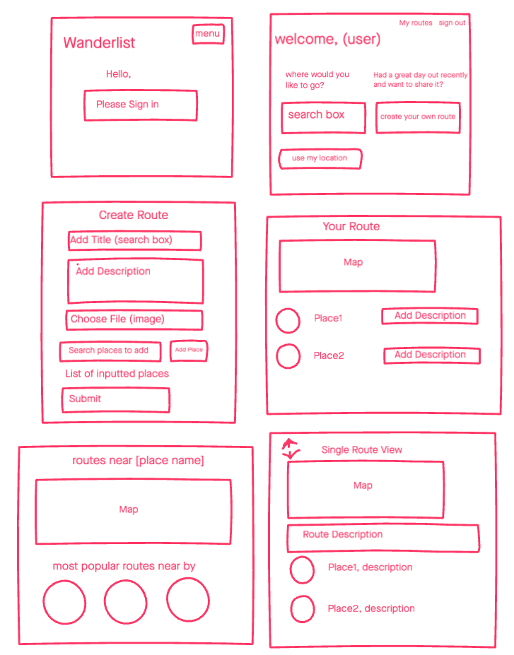

[](https://travis-ci.org/Megscode/Wanderlist)
[](https://codeclimate.com/github/Megscode/Wanderlist/maintainability)
[](https://codeclimate.com/github/Megscode/Wanderlist/test_coverage)

### [Makers Academy](http://www.makersacademy.com) - Final Engineering Project

# Wanderlist 🥾


Link to App - https://wanderlist-makers.herokuapp.com/

#### Technologies: Ruby, Rspec, Capybara, Rails, HTML, CSS, TravisCI, CodeClimate

[Task](#Task) | [Collaborators](#Collaborators) | [Installation Instructions](#Installation) | [Headline Specifications](#Headline_Specifications) | [User Stories](#User_Stories) | [Mockup](#Mockup) | [Further improvements](#Further_Improvements)


## <a name="Task">The Task</a>

This challenge is a final week engineering programming project at [Makers Academy](https://github.com/makersacademy).

## <a name="Collaborators">Collaborators</a>

* [Dafna Libman](https://github.com/dlibmanw)
* [David McGregor](https://github.com/davmcgregor)
* [Liz Daly](https://github.com/lookupdaily)
* [Megan Hayes](https://github.com/megscode)
* [Richard Pattinson](https://github.com/richardpattinson)

## <a name="Installation">Installation Instructions</a>

First, clone this repository. Then:

```bash
> bundle install
> yarn
> bin/rails db:create
> bin/rails db:migrate

> bundle exec rspec # Run the tests to ensure it works
> bin/rails server # Start the server at localhost:3000
```
To run tests:
```bash
> rspec # Run the tests
> rubocop # Check code quality
```

## <a name="Headline_Specifications">Headline Specifications</a>

A user can:
* Sign up and login to the app;
* Make a new route by searching for places and adding them; 
* Search for existing routes near them;
* Vote on other users' routes;
* View routes ranked on popularity.

## <a name="User_Stories">User Stories</a>

### MVP

```
As a user,
So that I can create routes,
I would like to add stops (map markers) to my route
```
```
As a user, 
So that I can see my saved route,
I would like to see a line on the map
```
```
As a user,
So that I can describe my route,
I would like to be able to add a description to my route
```
```
As a user,
So that I can share my route, 
I would like to be able to give a route a title 
```
```
As a user,
So that I can see my routes,
I would like to be able to publish my route
```
```
As a user,
So that I can have a fun day out,
I would like to be able to see a list of routes
```

### Additional Features

```
As a user, 
So that I can create routes,
I would like to be able to sign into the app with my google account
```
```
As a user, 
So that I can add stops to my route,
I would like to be able to search for existing places to add
```
```
As a user,
So that I can recommend a stop,
I would like to add a note to a stop
```

### Extra

```
As a user,
So that I can share my route, 
I would like to be able to send my route via a link
```
```
As a user,
So that I can describe my route,
I would like to be able to add categories to my route
```

## <a name="Mockup">Mockups</a>



## <a name="Further_Improvements">Further_Improvements</a>

* Add upload image to routes feature
* Add mobile functionality
* Refactor JS
* Continue styling


